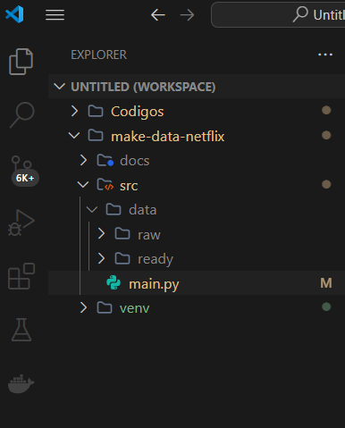

## 📊Projeto de ETL com Python
Este projeto é uma aplicação prática de ETL (Extract, Transform, Load), desenvolvida para consolidar conhecimentos em extração e transformação de dados utilizando Python e suas bibliotecas nativas e de terceiros. A proposta é processar dados brutos em arquivos .xlsx, realizar transformações relevantes e gerar um dataset limpo e pronto para análise.

## 📁 Estrutura do Projeto

```bash
	src/
	├── data/
	│   ├── raw/       # Contém os arquivos brutos (.xlsx)
	│   └── ready/     # Destino dos arquivos processados (clean.xlsx)
	├── main.py        # Script principal de ETL
	venv/              # Ambiente virtual do projeto
	doc/               # Documentos e anotações relevantes
```


## ⚙️ Tecnologias e Ferramentas
- Python 3.13.0 — Linguagem principal.
- Pandas — Manipulação de dados tabulares.
- XlsxWriter — Escrita de arquivos Excel.
- os — Manipulação de diretórios e caminhos de sistema.
- glob — Leitura em lote de arquivos.

## 🚀 Funcionalidades
### 📥 Extração de Dados
- Identifica e carrega automaticamente todos os arquivos .xlsx na pasta src/data/raw.

### 🔄 Transformação de Dados
- Adição de coluna location: Baseada no nome do arquivo, define a origem dos dados:
	- 'br' para arquivos que contêm "brasil"
	- 'fr' para arquivos que contêm "france"
	- 'it' para arquivos que contêm "italian"
- Extração da campanha (campaign): Utiliza regex para extrair o valor do parâmetro utm_campaign da coluna utm_link.

### 📤 Carregamento dos Dados
- Consolida todos os DataFrames em um único arquivo clean.xlsx, salvo na pasta src/data/ready.

### ⚠️ Tratamento de Erros
- Exibe mensagens de erros ao falhar na leitura de arquivos, garantindo que os demais sejam processados.

## ▶️ Como Executar
#### 1º Clone este repositório:
```bash
	git clone https://github.com/seu-usuario/seu-repositorio.git
	cd seu-repositorio
```
#### 2º Crie um ambiente virtual
```bash
	python -m venv venv
	source venv/bin/activate  # ou venv\Scripts\activate no Windows
```

#### 3º Instale as dependências:

```bash
	pip install pandas
	pip install xlsxwriter
	
```
#### 4º Adicione seus arquivos .xlsx à pasta src/data/raw.
#### 5º Execute o script principal:
```bash
	python src/main.py
```
#### 6º O arquivo clean.xlsx será gerado em src/data/ready.

## 🎯 Objetivo do Projeto
Este projeto tem como objetivo fixar o entendimento prático dos conceitos de ETL com Python, estruturando um pipeline simples, mas funcional, para manipulação e limpeza de dados. Foi desenvolvido como parte de um estudo pessoal de boas práticas para Extração, tratamento, limpeza de dados e .

# Nota: As bases de dados utilizadas são fictícias e de uso livre, coletadas em repositórios públicos.
